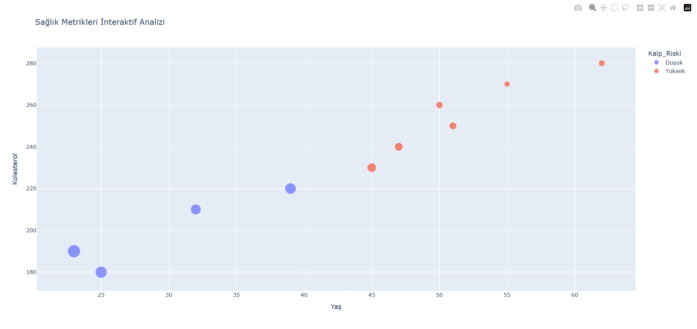

# Sağlık Verileri Görselleştirme Projesi

Bu projede, yaş ve kolesterol seviyeleri arasındaki ilişkiyi Python kullanarak analiz ettim.

## 🛠 Kullanılan Teknolojiler
* Python
* Pandas (Veri manipülasyonu)
* Seaborn & Matplotlib (Görselleştirme)

## 📊 Öne Çıkan Bulgular
* 40 yaş üstü bireylerde kalp riski artış eğilimindedir.
* Günlük adım sayısı, kolesterol etkisini dengeleyen kritik bir faktördür.

